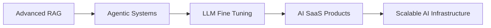

````md
<div align="center">

# Haaroon


<br>

<a href="https://github.com/Haaroom">

</a>

<a href="https://linkedin.com/in/ahamed-haaroon-14ba65337">

</a>


</div>

---

## 🚀 About Me

```yaml
Name: Haaroon
Education: Grade 12 (Higher Secondary)
Location: India

Current Focus:
  - AI Engineering
  - Agentic Systems
  - Retrieval Augmented Generation
  - Full Stack Development
  - LLM Fine Tuning

Mission:
  Build production-grade AI products
  before entering university.
````

I enjoy building systems where **AI, software engineering, and product thinking intersect**.

Most of my work revolves around:

* Multi-Agent Systems
* RAG Pipelines
* AI Workflows
* LLM Applications
* Full-Stack SaaS Products
* Developer Tools

---

# ⚡ Tech Arsenal

### AI Engineering

<p align="left">

</p>

```text
LangChain
LlamaIndex
RAG
AI Agents
Prompt Engineering
Context Engineering
Vector Databases
Embedding Models
Ollama
Model Serving
Tool Calling
Workflow Automation
```

---

### LLM Engineering

```text
Transformers
Fine-Tuning Fundamentals
LoRA / QLoRA
Quantization
Inference Optimization
Local LLM Deployment
Structured Outputs
Agent Frameworks
```

---

### Full Stack Development

<p align="left">

</p>

```text
MERN Stack
REST APIs
Authentication
State Management
Backend Architecture
Frontend Engineering
```

---

### Databases

<p align="left">

</p>

```text
MongoDB
SQL
Database Design
Schema Modeling
Query Optimization
```

---

### Systems & Networking

```text
TCP/IP
HTTP / HTTPS
DNS
Client Server Architecture
API Communication
Network Fundamentals
Linux Fundamentals
```

---

# 🏗 Featured Build

## AI Engineering Studio

A vibe-coded AI development environment designed for rapid AI product creation.

### Features

```text
Agent Creation
Prompt Playground
Workflow Builder
Knowledge Integration
RAG Experiments
Rapid Prototyping
```

### Goal

Build a complete ecosystem where developers can design,
test, deploy and iterate AI systems from a single workspace.

---

# 📈 Current Learning Path



---

# 🎯 2026 Objectives

* Launch Production AI Products
* Contribute to Open Source
* Master LLM Engineering
* Build Scalable SaaS Systems
* Work with Real Clients
* Create High Impact AI Tools

---

# 📊 GitHub Analytics

<div align="center">


</div>

---

# 💭 Engineering Philosophy

> Build.
>
> Break.
>
> Learn.
>
> Improve.
>
> Repeat.

---

<div align="center">

### Let's Build Something Interesting

💼 LinkedIn: linkedin.com/in/ahamed-haaroon-14ba65337

⭐ If you find my work interesting, feel free to connect.

</div>
```
