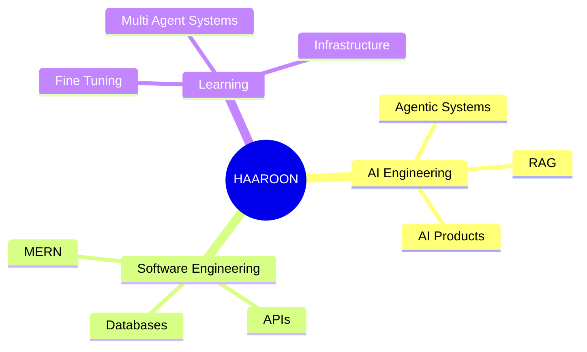

````md
<div align="center">


</div>

<div align="center">


</div>

<br>

<div align="center">


</div>

---

# > whoami

```bash
Name        :: Haaroon
Age Group   :: Student
Education   :: Grade 12 (Higher Secondary)

Role        :: AI Engineer
Focus       :: Agentic AI + Full Stack Systems

Status      :: Building products before college

Mission     :: Build useful AI systems
               that solve real problems.
````

---

# > system_overview

I don't just learn technologies.

I build systems.

My interests sit at the intersection of:

```yaml
Artificial Intelligence:
  - Agentic Workflows
  - AI Products
  - LLM Applications
  - Prompt Engineering
  - Context Engineering

Retrieval Systems:
  - Advanced RAG
  - Hybrid Search
  - Vector Databases
  - Knowledge Retrieval
  - Semantic Search

Software Engineering:
  - MERN Applications
  - Backend Systems
  - API Design
  - Database Architecture

Research Areas:
  - LLM Fine-Tuning
  - Multi-Agent Systems
  - AI Infrastructure
```

---

# > currently_building

<div align="center">

```text
┌──────────────────────────────────────────────┐
│ AI ENGINEERING STUDIO                        │
├──────────────────────────────────────────────┤
│ Build Agents                                │
│ Create Workflows                            │
│ Prototype AI Products                       │
│ Experiment With RAG Systems                 │
│ Test LLM Architectures                      │
└──────────────────────────────────────────────┘
```

</div>

A vibe-coded environment where AI systems can be designed,
tested and deployed rapidly.

---

# > tech_stack

<div align="center">


</div>

<br>

<div align="center">

| AI & ML    | Backend        | Frontend        | Data          |
| ---------- | -------------- | --------------- | ------------- |
| LangChain  | Node.js        | React           | MongoDB       |
| LlamaIndex | Express        | JavaScript      | SQL           |
| Ollama     | REST APIs      | HTML/CSS        | Data Modeling |
| RAG        | Authentication | Responsive UI   | Query Design  |
| AI Agents  | System Design  | UI Architecture | Optimization  |

</div>

---

# > neural_network

<div align="center">



</div>

---

# > github_metrics

<div align="center">


</div>

<br>

<div align="center">


</div>

---

# > roadmap_2026

```diff
+ Launch Production AI Products
+ Publish Advanced RAG Projects
+ Master Agentic Architectures
+ Build AI SaaS Systems
+ Contribute To Open Source
+ Work With Real Users
```

---

# > philosophy

```python
while alive:

    build()

    fail()

    learn()

    improve()

    repeat()
```

---

<div align="center">

## Connect

<a href="https://linkedin.com/in/ahamed-haaroon-14ba65337">

</a>

<a href="https://github.com/Haaroom">

</a>

</div>

<br>

<div align="center">


</div>
```
