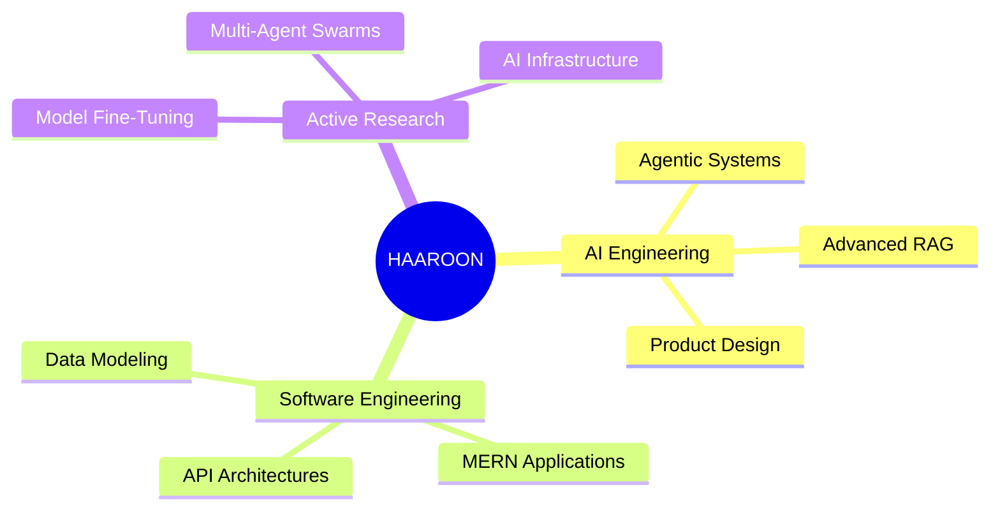

<div align="center">


<br>


</div>

---

###  `> whoami`

```bash
# System Identification
Name        :: Haaroon
Age Group   :: Student
Education   :: Grade 12 (Higher Secondary)

# Operational Profile
Role        :: AI Engineer
Focus       :: Agentic AI + Full Stack Systems
Status      :: Building production products before college

# Core Mission
Mission     :: Build production-ready AI systems 
               that solve complex, real-world problems.
```

---

### `> system_overview`

I don't just consume technologies. **I architect end-to-end systems.** 

My development workflow sits at the critical intersection of:

```yaml
Artificial Intelligence:
  - Agentic Workflows & Tool Use
  - Production LLM Applications
  - Advanced Prompt Engineering
  - Context Window Optimization

Retrieval Systems:
  - Production RAG Pipelines
  - Hybrid Lexical/Vector Search
  - Vector Databases (Pinecone, Chroma)
  - Semantic Knowledge Graphs

Software Engineering:
  - MERN Stack Applications
  - Scalable Backend Systems
  - Secure API Design
  - Database Architecture & Normalisation
```

---

### `> currently_building`

<div align="center">

```text
┌──────────────────────────────────────────────┐
│          AI ENGINEERING STUDIO               │
├──────────────────────────────────────────────┤
│  [■] Orchestrate Autonomous Agents          │
│  [■] Design State-Driven Workflows          │
│  [■] Prototype Next-Gen AI Products         │
│  [■] Stress-Test Advanced RAG Pipelines     │
│  [■] Benchmark Open-Source LLM Architectures │
└──────────────────────────────────────────────┘
```

*A production-grade sandboxed environment for rapid AI system design, testing, and deployment.*

</div>

---

### `> tech_stack`

<div align="center">


<br><br>

| AI & Orchestration | Backend Systems | Frontend UI | Data Architecture |
| :--- | :--- | :--- | :--- |
| LangChain / LangGraph | Node.js | React.js | MongoDB |
| LlamaIndex | Express.js | TypeScript / JS | SQL / PostgreSQL |
| Ollama / Local Models | RESTful APIs | Tailwind CSS | Vector Embedding Models |
| Advanced RAG | JWT Authentication | Responsive UI Design| Cache Optimization |

</div>

---

### `> core_architecture`

<div align="center">



</div>

---

### `> github_metrics`

<div align="center">


<br>


</div>

---

### `> roadmap_2026`

```diff
+ Deploy Scalable Production AI SaaS Products
+ Open-Source Enterprise-Grade RAG Implementations
+ Master Multi-Agent Swarm Architectures
+ Build For Real-World Active Users
+ Contribute Meaningfully to Core Open-Source AI Repos
```

---

### `> operational_philosophy`

```python
import time

def lifetime_execution_loop():
    while operational_status == "ALIVE":
        architect_and_build()
        analyze_failures()
        synthesize_learnings()
        optimize_and_improve()
        
        # Continuous iteration loop
        time.sleep(1) 
```

---

<div align="center">

### `> connect_with_me`

<a href="https://linkedin.com/in/ahamed-haaroon-14ba65337" target="_blank">

</a>
&nbsp;&nbsp;
<a href="https://github.com/Haaroom" target="_blank">

</a>

<br><br>


</div>
